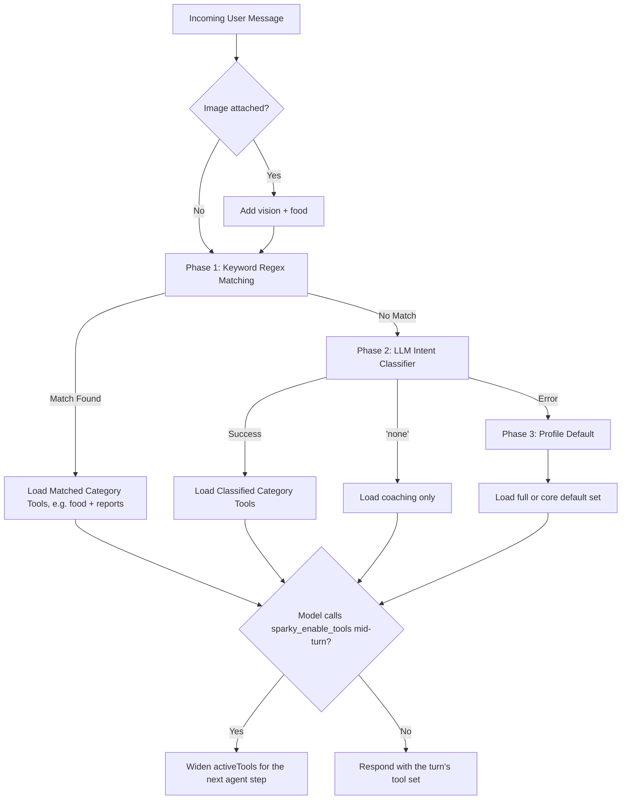

# Sparky Chatbot Workflow (Refined)

This document outlines the refined workflow for how the Sparky chatbot processes user messages, identifies intent, extracts data, interacts with the database, and provides responses, incorporating improvements for robustness, multi-item handling, context, and error management.

## Overall Process

1.  **User Input:** The user sends a message to the chatbot in natural language, potentially including text and/or an image.
2.  **AI Intent Recognition & Data Extraction:** The chatbot sends the user's message to the AI model along with recent conversation history (e.g., the last 5 messages) and a detailed system prompt. The system prompt will instruct the AI to:
    *   **Prioritize the current user message** when determining intent and extracting data.
    *   Use the conversation history primarily for **context** (e.g., understanding follow-ups like "add another one", clarifying ambiguous terms, or referencing previous items).
    *   **Avoid re-processing requests** that appear to have been completed in the recent history.
3.  **Application Logic (SparkyNutritionCoach):** Based on the `intent` provided by the AI, the application logic routes the request to the appropriate handler function.
4.  **Database Interaction:** The handler function interacts with the Supabase database to log data (food entries, exercise entries, measurements) or retrieve information.
5.  **Response Generation:** Based on the success or failure of the database operation, or if the intent was conversational, a user-friendly response message is generated.
6.  **User Output:** The generated response message is displayed to the user in the chat interface.

## Detailed Workflow by Intent

The AI is designed to identify one of the following intents:

1.  **Log Food (`log_food`)**
    *   **AI Data:** `food_name` (string), `quantity` (number, inferred or default 1), `unit` (string, inferred or default "g"), `meal_type` (string, inferred or default "snack"), `date` (string, ISO format, inferred or null).
    *   **Application Logic:**
        *   **Validation:** Check if `food_name` is present and is a string.
        *   Search for the extracted `food_name` in the `foods` table (user's custom first, then public).
        *   **If Food Found:** Log a new entry in the `food_entries` table using the found `food_id`, extracted `quantity`, `unit`, `meal_type`, and the extracted `date` (defaulting to today if null). Validate the date to prevent logging future entries.
        *   **If Food Not Found:** Send a secondary request to the AI specifically asking it to generate 3 realistic food options similar to the requested `food_name`, including estimated nutritional details and serving information. Include context like the original input and potentially user preferences (e.g., dietary restrictions) in the prompt.
        *   **AI Options Response:** AI returns JSON with `food_options` array.
        *   **Application Logic (Options):** Display the generated food options to the user in a numbered list. Guide the user to reply with a number to select an option OR provide manual nutrition details (e.g., "If none fit, reply with 'manual: 100 cal, 5g protein...'"). Store the options data (including original request details) in the chat message's metadata for handling the user's subsequent selection or manual entry.
2.  **Log Exercise (`log_exercise`)**
    *   **AI Data:** `exercise_name` (string), `duration_minutes` (number, inferred or null), `distance` (number, inferred or null), `distance_unit` (string, inferred or null), `date` (string, ISO format, inferred or null).
    *   **Application Logic:**
        *   **Validation:** Check if `exercise_name` is present and is a string.
        *   Search the `exercises` table for the extracted `exercise_name`.
        *   **If Exercise Found:** Log a new entry in the `exercise_entries` table with extracted details (`exercise_id`, `duration_minutes` - using AI value or default from DB, `calories_burned` - calculated, `distance`, `distance_unit`, extracted `date`). Validate the date.
        *   **If Exercise Not Found:** Send a secondary request to the AI specifically asking it to generate 3 exercise options similar to the requested exercise, including estimated `calories_per_hour`.
        *   **AI Options Response:** AI returns JSON with `exercise_options` array.
        *   **Application Logic (Options):** Display the generated exercise options to the user in a numbered list. Guide the user on how to provide manual details if needed. Store options data in metadata.
3.  **Log Body Measurements (`log_measurement` - standard types)**
    *   **AI Data:** `measurements` (array of objects), each with `type` ("weight", "neck", "waist", "hips", "steps"), `value` (number), `unit` (string, inferred or null, except for steps which defaults to "steps"), `date` (string, ISO format, inferred or null).
    *   **Application Logic:**
        *   **Validation:** Check if `measurements` is an array and each object has `type` and `value`.
        *   For each measurement in the `measurements` array:
            *   If `type` is standard: Upsert into the `check_in_measurements` table for the user and the extracted `date` (defaulting to today). Validate the date.
        *   Generate a confirmation message listing the measurements that were successfully logged.
4.  **Log Custom Measurements (`log_measurement` - custom type)**
    *   **AI Data:** `measurements` (array of objects), each with `type` ("custom"), `name` (string), `value` (number), `unit` (string, inferred or null), `date` (string, ISO format, inferred or null).
    *   **Application Logic:**
        *   **Validation:** Check if `measurements` is an array and each custom object has `type`, `name`, and `value`.
        *   For each custom measurement in the `measurements` array:
            *   Search for a category with the extracted `name` in the `custom_categories` for the user.
            *   **If Category Found:** Use the found `category_id`.
            *   **If Category Not Found:** Create a new entry in `custom_categories` with the extracted `name`, defaulting `frequency` to 'daily' and `measurement_type` to 'numeric'. Use the new `category_id`.
            *   Insert a new entry in the `custom_measurements` with user ID, `category_id`, extracted `value`, and extracted `date`/timestamp (defaulting to now). Validate the date.
        *   Generate a confirmation message listing the custom measurements that were successfully logged.
5.  **Log Water Intake (`log_water`)**
    *   **AI Data:** `glasses_consumed` (number, inferred or default 1), `date` (string, ISO format, inferred or null).
    *   **Application Logic:**
        *   **Validation:** Check if `glasses_consumed` is a number or null.
        *   Get the current water intake for the user for the extracted `date` (defaulting to today).
        *   Calculate the new total by adding the extracted `glasses_consumed` (or default 1) to the current total.
        *   Upsert the new total into the `water_intake` table for the user and the extracted `date`. Validate the date.
        *   Generate a confirmation message showing the added glasses and the new total for the day.
6.  **Ask Question (`ask_question`) / General Chat (`chat`)**
    *   **AI Data:** Empty `data` object, `response` (string containing the AI's conversational reply).
    *   **Application Logic:**
        *   Display the `response` provided directly by the AI.

### 3. Post-Logging Actions & User Interaction

*   **After successful logging (any type):**
    *   Trigger a refresh of relevant data displays (e.g., food diary, measurements charts).
    *   **Refined Progress Updates:** Batch progress updates for multi-item inputs (display one summary after all items are processed). For single item logs, update immediately. The update message should include a summary of today's relevant data (nutrition, exercise, measurements) and a coaching tip. Tailor the summary slightly based on the type of item just logged.
*   **Handling Option Selection:**
    *   If the user's next message is a number and the previous bot message contained options metadata:
        *   **Validation:** Check if the number is a valid index for the options stored in the metadata and if the metadata is still valid/present.
        *   **If Valid Selection:** Process the selected option using the stored data (e.g., call `addFoodOption` or `addExerciseOption`).
        *   **If Invalid Selection:** Return a `CoachResponse` with `action: 'none'` and a message guiding the user (e.g., "Please select a valid option number or tell me what you'd like to do.").
    *   If the user's next message is not a number but matches the format for manual data entry (e.g., "manual: ..."), process the manual entry.
    *   If the user's next message is unrelated, process it as a new input using the standard AI workflow.

### Relevant Database Tables

Here are the schemas for the relevant database tables for context:

```sql
-- check_in_measurements table
create table public.check_in_measurements (
  id uuid not null default gen_random_uuid (),
  user_id uuid not null,
  entry_date date not null default CURRENT_DATE,
  weight numeric null,
  neck numeric null,
  waist numeric null,
  hips numeric null,
  steps integer null,
  created_at timestamp with time zone not null default now(),
  updated_at timestamp with time zone not null default now(),
  constraint check_in_measurements_pkey primary key (id),
  constraint check_in_measurements_user_date_unique unique (user_id, entry_date)
) TABLESPACE pg_default;
```

```sql
-- custom_categories table
create table public.custom_categories (
  id uuid not null default gen_random_uuid (),
  user_id uuid not null,
  name character varying(50) not null,
  measurement_type character varying(50) not null, -- e.g., 'numeric', 'text'
  frequency text not null, -- e.g., 'Daily', 'Weekly', 'Monthly', 'All'
  created_at timestamp with time zone not null default now(),
  updated_at timestamp with time zone not null default now(),
  constraint custom_categories_pkey primary key (id),
  constraint custom_categories_user_id_fkey foreign KEY (user_id) references auth.users (id),
  constraint custom_categories_frequency_check check (
    (
      frequency = any (array['All'::text, 'Daily'::text, 'Hourly'::text, 'Weekly'::text, 'Monthly'::text]) -- Added Weekly, Monthly based on common use cases
    )
  )
) TABLESPACE pg_default;
```

```sql
-- custom_measurements table
create table public.custom_measurements (
  id uuid not null default gen_random_uuid (),
  user_id uuid not null,
  category_id uuid not null,
  value numeric not null,
  entry_date date not null,
  entry_hour integer null, -- For hourly frequency
  entry_timestamp timestamp with time zone not null default now(),
  created_at timestamp with time zone not null default now(),
  constraint custom_measurements_pkey primary key (id),
  constraint custom_measurements_unique_entry unique (user_id, category_id, entry_date, entry_hour), -- Ensure uniqueness based on frequency
  constraint custom_measurements_category_id_fkey foreign KEY (category_id) references custom_categories (id) on delete CASCADE,
  constraint custom_measurements_user_id_fkey foreign KEY (user_id) references auth.users (id)
) TABLESPACE pg_default;
```

```sql
-- food_entries table
create table public.food_entries (
  id uuid not null default gen_random_uuid (),
  user_id uuid not null,
  food_id uuid not null,
  meal_type character varying(50) not null, -- e.g., 'breakfast', 'lunch', 'dinner', 'snack'
  quantity numeric not null,
  unit character varying(50) null, -- e.g., 'g', 'oz', 'piece'
  entry_date date not null,
  created_at timestamp with time zone not null default now(),
  variant_id uuid null, -- Link to food_variants if applicable
  constraint food_entries_pkey primary key (id),
  constraint food_entries_food_id_fkey foreign KEY (food_id) references foods (id),
  constraint food_entries_user_id_fkey foreign KEY (user_id) references auth.users (id),
  constraint food_entries_variant_id_fkey foreign KEY (variant_id) references food_variants (id)
) TABLESPACE pg_default;
```

```sql
-- foods table
create table public.foods (
  id uuid not null default gen_random_uuid (),
  name character varying(255) not null,
  calories numeric null,
  protein numeric null,
  carbs numeric null,
  fat numeric null,
  serving_size numeric null, -- Default serving size in grams or standard unit
  serving_unit character varying(50) null, -- e.g., 'g', 'ml', 'piece'
  is_custom boolean null default false, -- True if created by a user
  user_id uuid null, -- Creator user_id if is_custom is true
  created_at timestamp with time zone null default now(),
  updated_at timestamp with time zone null default now(),
  barcode character varying(255) null, -- For scanning
  openfoodfacts_id character varying(255) null, -- Link to external databases
  shared_with_public boolean null default false,
  saturated_fat numeric null, -- Added for comprehensive nutrition
  polyunsaturated_fat numeric null,
  monounsaturated_unsaturated numeric null,
  trans_fat numeric null,
  cholesterol numeric null,
  sodium numeric null,
  potassium numeric null,
  dietary_fiber numeric null,
  sugars numeric null,
  vitamin_a numeric null,
  vitamin_c numeric null,
  calcium numeric null,
  iron numeric null,
  constraint foods_pkey primary key (id),
  constraint foods_user_id_fkey foreign KEY (user_id) references auth.users (id)
) TABLESPACE pg_default;
```

```sql
-- exercise_entries table
create table public.exercise_entries (
  id uuid not null default gen_random_uuid (),
  user_id uuid not null,
  exercise_id uuid not null,
  duration_minutes integer not null,
  calories_burned integer not null,
  entry_date date null,
  notes text null,
  created_at timestamp with time zone null default now(),
  constraint exercise_entries_pkey primary key (id),
  constraint exercise_entries_exercise_id_fkey foreign KEY (exercise_id) references exercises (id),
  constraint exercise_entries_user_id_fkey foreign KEY (user_id) references auth.users (id)
) TABLESPACE pg_default;
```

```sql
-- exercises table
create table public.exercises (
  id uuid not null default gen_random_uuid (),
  name character varying(255) not null,
  category character varying(50) null, -- e.g., 'cardio', 'strength'
  calories_per_hour integer null, -- Estimated calories burned per hour
  description text null,
  is_custom boolean null default false,
  user_id uuid null, -- Creator user_id if is_custom is true
  created_at timestamp with time zone null default now(),
  updated_at timestamp with time zone null default now(),
  shared_with_public boolean null default false,
  constraint exercises_pkey primary key (id),
  constraint exercises_user_id_fkey foreign KEY (user_id) references auth.users (id)
) TABLESPACE pg_default;
```

```sql
-- water_intake table
create table public.water_intake (
  id uuid not null default gen_random_uuid (),
  user_id uuid not null,
  entry_date date not null,
  glasses_consumed integer not null,
  created_at timestamp with time zone not null default now(),
  updated_at timestamp with time zone not null default now(),
  constraint water_intake_pkey primary key (id),
  constraint water_intake_user_date_unique unique (user_id, entry_date),
  constraint water_intake_user_id_fkey foreign KEY (user_id) references auth.users (id)
) TABLESPACE pg_default;
```

```sql
-- ai_service_settings table
create table public.ai_service_settings (
  id uuid not null default gen_random_uuid (),
  user_id uuid not null,
  service_name character varying(255) not null, -- e.g., 'OpenAI', 'Google Gemini'
  service_type character varying(50) not null, -- e.g., 'openai', 'google'
  api_key text not null,
  is_active boolean not null default true,
  model_name character varying(255) null, -- Specific model used
  system_prompt text null, -- Custom system prompt for the AI
  custom_url text null, -- For custom or compatible services
  created_at timestamp with time zone not null default now(),
  updated_at timestamp with time zone not null default now(),
  constraint ai_service_settings_pkey primary key (id),
  constraint ai_service_settings_user_id_fkey foreign KEY (user_id) references auth.users (id)
) TABLESPACE pg_default;
```

```sql
-- sparky_chat_history table
create table public.sparky_chat_history (
  id uuid not null default gen_random_uuid (),
  user_id uuid not null,
  session_id uuid not null default gen_random_uuid (), -- To group messages by session
  message_type character varying(50) not null, -- 'user' or 'assistant'
  content text not null, -- The message content
  created_at timestamp with time zone not null default now(),
  metadata jsonb null, -- To store additional data like food options, image URLs, etc.
  -- Deprecated fields, kept for history but not actively used in new workflow:
  message text null,
  response text null,
  image_url text null,
  constraint sparky_chat_history_pkey primary key (id),
  constraint sparky_chat_history_user_id_fkey foreign KEY (user_id) references auth.users (id)
) TABLESPACE pg_default;
```

```sql
-- user_preferences table
create table public.user_preferences (
  id uuid not null default gen_random_uuid (),
  user_id uuid not null,
  date_format character varying(50) not null default 'yyyy-MM-dd',
  default_weight_unit character varying(50) not null default 'kg',
  default_measurement_unit character varying(50) not null default 'cm',
  auto_clear_history text null default 'never', -- 'never', 'session', '7days', '30days'
  system_prompt text null, -- User-specific override for AI system prompt
  created_at timestamp with time zone not null default now(),
  updated_at timestamp with time zone not null default now(),
  constraint user_preferences_pkey primary key (id),
  constraint user_preferences_user_id_fkey foreign KEY (user_id) references auth.users (id) on delete CASCADE,
  constraint user_preferences_auto_clear_history_check check (
    (
      auto_clear_history = any (array['never'::text, 'session'::text, '7days'::text, '30days'::text])
    )
  )
) TABLESPACE pg_default;
```

```sql
-- user_goals table
create table public.user_goals (
  id uuid not null default gen_random_uuid (),
  user_id uuid not null,
  goal_date date null, -- Null for default goal
  calories numeric null,
  protein numeric null,
  carbs numeric null,
  fat numeric null,
  water_goal integer null,
  created_at timestamp with time zone null default now(),
  updated_at timestamp with time zone null default now(),
  saturated_fat numeric null, -- Added for comprehensive nutrition goals
  polyunsaturated_fat numeric null,
  monounsaturated_fat numeric null,
  trans_fat numeric null,
  cholesterol numeric null,
  sodium numeric null,
  potassium numeric null,
  dietary_fiber numeric null,
  sugars numeric null,
  vitamin_a numeric null,
  vitamin_c numeric null,
  calcium numeric null,
  iron numeric null,
  constraint user_goals_pkey primary key (id),
  constraint user_goals_user_id_fkey foreign KEY (user_id) references auth.users (id),
  constraint user_goals_unique_user_date unique (user_id, goal_date) -- Ensure only one goal per user per date
) TABLESPACE pg_default;
```

## Chatbot Tool Profiles & Dynamic Category Classification

To support smaller local models (e.g. Ollama running Gemma or Llama models) that have limited context windows and struggle with high tool counts, the chatbot does not send every available tool to the provider on every turn. Instead, it utilizes **Dynamic Tool Selection**, **Auto Intent Classification**, and a **self-healing escalation tool** that lets the model recover from a classification miss mid-conversation.

### 1. Tool Profiles: Full vs. Core
The system defines two main tool configuration profiles matching the user's active AI Service Settings:
*   **`full` Profile (35 domain tools):** Contains all developer, coaching, and granular utility tools.
*   **`core` Profile (19 domain tools):** Contains only the essential logging and tracking tools for food, exercise, checkins, and goals.

### 2. Two Modes: Manual Selection vs. Auto Classification
How the category set is chosen determines whether the tool set is a **strict ceiling** or a **self-healing floor**:

*   **Manual selection (strict ceiling):** If the user explicitly picks categories in the chat tool selector, the server composes exactly that narrow set via `buildChatbotTools` (the last tool carries the Anthropic cache breakpoint) and offers **no** escalation tool. The system prompt lists the dormant domains and instructs the model to tell the user to enable that category in the tool selector — it must never attempt or fake a capability it wasn't given. This respects the user's deliberate limit (and their token budget on small models).
*   **Auto classification (self-healing floor):** If the user does not pick categories, the server classifies intent (pipeline below) and serves tools from a single in-memory full surface per `(userId, tz)` (`buildChatToolSurface` in `ai/tools/index.ts`) that always composes every domain plus one extra tool, `sparky_enable_tools`. The classified categories narrow what is actually *sent* to the provider that turn via the AI SDK's `activeTools`, while the always-present escalation tool lets a capable model widen the set mid-turn (section 4). The Anthropic cache breakpoint sits on `sparky_enable_tools`, which is always in `activeTools`, so caching stays stable.

The MCP tool surface (`buildChatbotTools`) is unaffected by any of this — it always publishes the full or core set directly and has no escalation tool.

> **Note on small local models:** the escalation tool (section 4) only helps if the model is capable enough to notice a missing tool and call `sparky_enable_tools` for it. Very small models (e.g. a 2B Gemma/Llama) often will not — they may just hallucinate success. For those, getting the classification right up front (or a well-chosen manual selection) matters far more than escalation.

### 3. Auto Intent Classification Pipeline
When the user has not manually selected categories, the backend dynamically calculates the minimum required tool categories for each message via an automatic classification pipeline:



#### Deterministic Vision Routing
An attached image always adds `vision` (and `food`, the dominant meal-photo case) to the matched categories before keyword or LLM classification runs — this is unambiguous, so it never goes through the fuzzier keyword/LLM paths.

#### Phase 1: Fast Keyword Regex Matching (0ms Overhead)
Before making any model calls, the server matches the user's message against a set of predefined regex keywords for each domain (e.g. `"calories"`, `"eat"`, or stems like `"summar(y|ize|ise)"` for `food`/`reports`; `"walked"`, `"lifted"`, or `"swim"`/`"yoga"` for `exercise`). All rules run against the full message — a message can and often does match multiple domains at once (e.g. *"summarize what I ate and did yesterday"* matches both `food` and `reports`), and every match is kept: loading an extra category costs a little payload, but missing one blocks the request outright, so keyword matching always favors recall over precision.
*   **Outcome:** If any rule matches, the server bypasses the LLM classifier completely. This results in **0ms overhead** and **0 token cost**.
*   **By design, this list is intentionally not exhaustive and is English-only.** User phrasing is unbounded across paraphrases, typos, and languages; growing the regex list indefinitely trades recall for false positives (e.g. an overly broad "run" rule would fire on "I ran out of milk"). Phase 1 matching is English-only; non-English queries will simply fall back to Phase 2 (the LLM Intent Classifier), which naturally handles multilingual intent. Gaps here are expected to be caught by Phase 2, or recovered from via the escalation tool (below) if even Phase 2 misses.

#### Phase 2: LLM Classifier Fallback (Low-Latency)
If no keyword rule matched, it triggers a low-latency LLM intent classification request.
*   **Context:** It sends the last **2 messages of context** (the assistant's previous reply + the user's latest query) to ensure short answers like *"today"* or *"yes"* are correctly understood in context.
*   **Outcome:** The model is instructed to output only a comma-separated list of active categories (e.g. `"food, exercise"`). The server parses this string and registers only those specific toolsets.
*   **`"none"` response:** A confident "no domain applies" (general chit-chat) loads just the `coaching` category rather than falling back to a wider default — the escalation tool recovers if that guess is wrong.

#### Phase 3: Profile Default Fallback
If the LLM classifier call itself fails (network/service error — as opposed to a confident `"none"`):
*   **Outcome:** The server no longer forces a fixed category subset. Instead it defers to the tool profile's own default: the `full` profile's default is every category, and the `core` profile's default is `['food', 'exercise', 'checkin', 'goals']`. This keeps the same "never send more than a small local model can handle" guarantee that the `core` profile exists for, while cloud/full-profile users still get everything by default when classification is unavailable.

### 4. Escalation: `sparky_enable_tools` (auto mode only)
Because no classifier tier is perfect, the **auto-classification** tool surface always includes one extra tool, `sparky_enable_tools`. If the model realizes mid-conversation that it needs a tool category that wasn't loaded (e.g. it was classified to `food` but the user also wants exercise logged), it calls `sparky_enable_tools` with the missing category slugs. A `prepareStep` callback (`buildEscalationPrepareStep` in `services/chatService.ts`) inspects the prior agent step for that call and widens `activeTools` for the next step accordingly — no re-classification or tool-map recomposition needed. The system prompt lists any dormant categories and instructs the model to call this tool before telling the user something isn't possible, so a classification miss becomes one extra agent step instead of a wrong answer.

This escalation path is deliberately **disabled for manual selections** (section 2): a manual pick is a limit the user set on purpose, so instead of self-widening, the model points the user back to the tool selector.

### 5. Modular Prompt Composition
To save context window tokens, the chatbot system prompts are split into modular markdown templates:
*   **Base Prompts (`chatbot-full.md` & `chatbot-core.md`):** Contain overall behavior, tone, and formatting instructions.
*   **Category Sub-prompts (e.g. `chatbot-full-food.md`, `chatbot-full-vision.md`):** Contain specialized instructions. These sub-prompts are dynamically appended **only** when their corresponding category tools are loaded. This saves up to 500-700 tokens on simple conversational or logging queries.

### 6. Resilient Tool Validation Fallbacks
To further support smaller local models that occasionally fail to extract required parameters:
*   **Exercise Logging Fallback:** If `log_exercise` is called without `exercise_id` or `exercise_name`, the handler automatically defaults the name to `"General Exercise"` and logs it successfully instead of throwing a validation error.
*   **Food Schema Enforcement:** The `food_name` description in the schema explicitly marks the parameter as required for `log_external_food` to ensure LLMs correctly populate it.